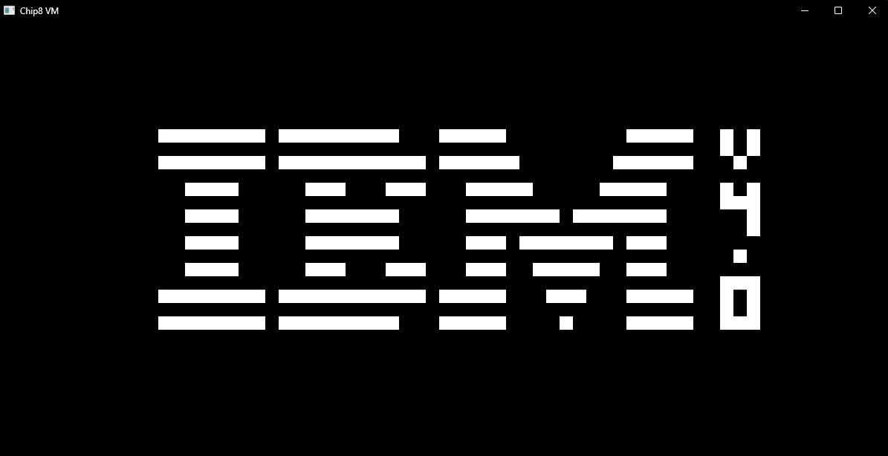

# Chip8 VM

## Introduction

An attempt at writing an "emulator" for the Chip8.

Most of the opcodes are working, as well as graphics.

## Goals

- [ ] Pass all of Timendus' ROM test (https://github.com/Timendus/chip8-test-suite)
	- [x] CHIP-8 splash screen
	- [x] IBM logo
	- [x] Corax+ opcode test
	- [x] Flags test
	- [ ] ...
- [ ] Keyboard input
- [ ] Timer
- [ ] Sound